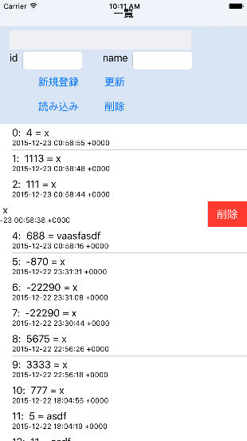

* list 表示の練習、ローカルデータの一覧、登録、更新、削除の練習。

+ 使い方
  - id, name欄を埋めてから 新規登録ボタンを押す。
  - list をクリックすると、その行の id, name が id, name 欄に自動転記される。
  - id, name 欄を編集して 更新ボタンや削除ボタンを押す。
  list の行を左にスライスすると、削除ボタンが現れる。  
  そのボタンをクリックすると、行は削除される。

* See http://daifuku-p.org/w/?p=485
  - SWIFTでCOREDATAを使う[CREATE編] [http://daifuku-p.org/w/?p=485](http://daifuku-p.org/w/?p=485)
  - SWIFTでCOREDATAを使う[CREATE編２] [http://daifuku-p.org/w/?p=502](http://daifuku-p.org/w/?p=502)
  - SWIFTでCOREDATAを使う[SELECT編] [http://daifuku-p.org/w/?p=529](http://daifuku-p.org/w/?p=529)

* xcode 7.2で compile, run できるように更新

